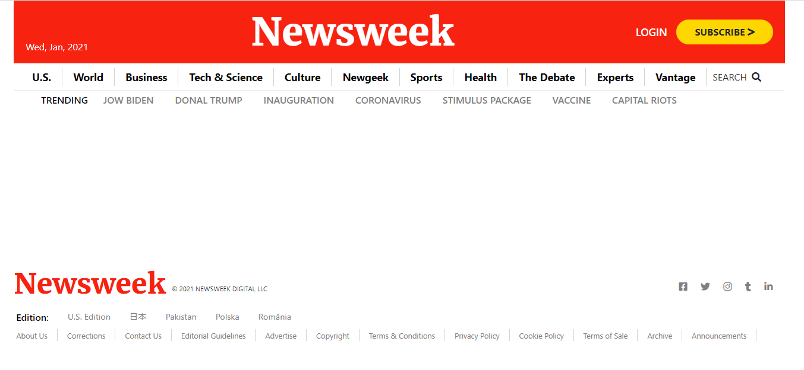

# Project 3: Using Bootstrap milestone 1

> This project consists of making a copy of the Newsweek website putting emphasis on bootstrap usage.

This replica of the Next Website navigation and footer using bootstap.

## Built With

- HTML
- CSS
- SASS
- BOOTSTRAP

## Live Demo

[Live Demo Link](https://rashad-muntar.github.io/New-Week-Clone/)

## Author

👤 **Rashad Muntar**

- GitHub: [@Rashad-Muntar](https://github.com/Rashad-Muntar)
- Twitter: [@RashadToure](https://twitter.com/twitterhandle)

## 🤝 Contributing

Contributions, issues, and feature requests are welcome!

Feel free to check the [issues page](issues/).

## Show your support

Give a ⭐️ if you like this project!

## Acknowledgments

- [Micoverse team](https://microverse.pathwright.com/library/new-technical-curriculum/177956/path/step/104246979/)

## 📝 License

This project is [MIT](lic.url) licensed.
